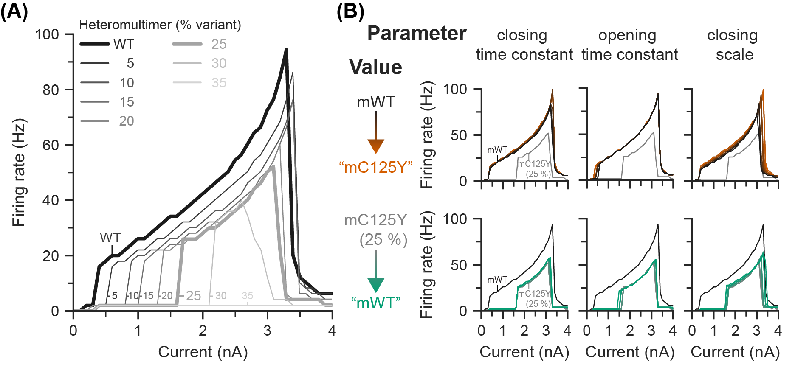

# PV-IN KCNC2 Kv3.2 A new genetic cause of childhood epilepsy

<!-- [PAPER link]() -->

## Results

### Main

### Supplementary

## Getting started

1. Install Python (preferably using anaconda)
2. Install python packages 
   
    `pip install -r requirements.txt`

3. (Optional, Windows only) [Install NEURON with an installer](https://neuron.yale.edu/neuron/download)
4. Run notebook

    `jupyter lab notebook.ipynb`
    or
    `jupyter notebook notebook.ipynb`

## About

This model uses the NEURON simulation environment

HOC template for PV model is found in `src/cells/PV_template.hoc`

Morphology and mechanisms found under `src/cells/morphologies` and `src/cells/mechanisms`

Model morphology and mechanisms taken from the BBP Neocortical Microcircuit Portal:
https://bbp.epfl.ch/nmc-portal/welcome

Original PV neuron derived from Berecki G, Bryson A, Terhag J, Maljevic S, Gazina EV, Hill SL, Petrou S (2019) SCN1A gain of function in early infantile encephalopathy. Ann Neurol 85:514-525
doi: 10.1002/ana.25438

The model was optimised using BluePyOpt:

"Van Geit W, Gevaert M, Chindemi G, Rossert C, Courcol J, Muller EB, Schurmann F, Segev I and Markram H (2016).BluePyOpt: Leveraging open source software and cloud infrastructure to optimise model parameters in neuroscience. Front. Neuroinform. 10:17.
doi: 10.3389/fninf.2016.00017

The axon and sodium channels were adjusted for the paper: Developmentally-regulated impairment of parvalbumin interneuron synaptic transmission in an experimental model of Dravet syndrome

